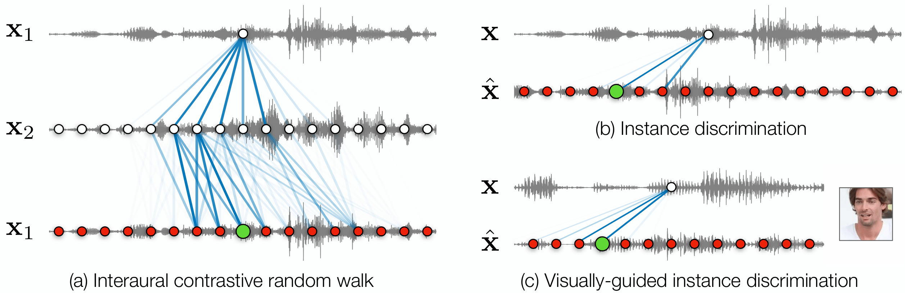

Sound Localization by Self-Supervised Time Delay Estimation
==================================================================
<h4>
Ziyang Chen, David F. Fouhey, Andrew Owens
</br>
<span style="font-size: 14pt; color: #555555">
University of Michigan
</span>
</br>

</h4>
<hr>

This repository contains the official codebase for [Sound Localization by Self-Supervised Time Delay Estimation](https://arxiv.org/abs/2204.12489). [[Project Page](https://ificl.github.io/stereocrw/)]

<div align="center">
  
</div>


## Environment
To setup the environment, please simply run

```bash
conda env create -f environment.yml
conda activate Stereo
```


## Datasets

#### Free Music Archive (FMA)
We perform self-supervised learning on this training dataset, data can be downloaded from [FMA offical github repo](https://github.com/mdeff/fma).

#### FAIR-Play
Data can be downloaded from [FAIR-Play offical github repo](https://github.com/facebookresearch/FAIR-Play).

#### TDE-Simulation <span id="TDE-Simulation"><span>
We create a simulated test set using [Pyroomacoustics](https://github.com/LCAV/pyroomacoustics). It contains approximately 6K stereo audio samples from three simulated environments with rooms of different sizes and microphone positions. We use [TIMIT](https://github.com/philipperemy/timit) as sound database. Our data can be downloaded from [Here](https://www.dropbox.com/s/f5yj5b0xa5tb2fh/tde-simulation.tar.gz?dl=0). You can simply download our dataset by running

```bash
cd Dataset/TDE-Simulation
chmod +x download_tde.sh
./download_tde.sh
```

We also provide the code for generating the stereo sound in `Dataset/TDE-Simulation/data-generation-advance.py`, you can create your own evaluation set. We have provided the evaluation information in `Dataset/TDE-Simulation/data-split`. 


#### In-the-wild data
We collected 1K samples from 30 internet binaural videos, and use human judgements to label sound directions. These videos contain a variety of sounds, including engine noise and human speech, which are often far from the viewer. The processed data could be downloaded from [Here](https://www.dropbox.com/s/be9n1jo14v7781o/in-the-wild.tar.gz?dl=0). You can simply download our dataset by running

```bash
cd Dataset/Youtube-Binaural
chmod +x download_inthewild.sh
./download_inthewild.sh
```

We also provide Youtube ID and timestamp in `Dataset/Youtube-Binaural/data-info/in-the-wild.csv`, you can download and process them with `Dataset/Youtube-Binaural/multi-download-process.sh`. Labels are provided in `Dataset/Youtube-Binaural/data-split/in-the-wild/test_with_label.csv`.

#### Visually-guided Time Delay Simulation Dataset
We use audio clips from VoxCeleb2 with the simulation parameters from [TDE-Simulation](#TDE-Simulation). We select 500 speakers from the database and pair them with their corresponding face images. The processed data could be downloaded from [Here](https://www.dropbox.com/s/o565wcawiik41cz/voxceleb2-simulation.tar.gz?dl=0). You can simply download our dataset by running

```bash
cd Dataset/VoxCeleb2
chmod +x download_voxceleb2_simulation.sh
./download_voxceleb2_simulation.sh
```
We have provided the evaluation information in `Dataset/VoxCeleb2/data-split/voxceleb-tde/Easy/test.csv`. 


## Model Zoo

We release several models pre-trained with our proposed methods. We hope it could benefit our research communities.

| Method     |size, stride, num|    Train Set   |     Test Set    |   MAE (ms)  |  RMSE (ms)  |     url    | 
|:----------:|:---------------:|:--------------:|:---------------:|:-----------:|:-----------:|:----------:|
| MonoCLR    |   1024, 4, 49   |   Free-Music   |  TDE-Simulation |  0.187      |    0.335    |[url](https://www.dropbox.com/s/tgg7fkusih1jp0q/FreeMusic-MonoCLR-1024.pth.tar?dl=0)    |
| ZeroNCE    |   1024, 4, 49   |   Free-Music   |  TDE-Simulation |  0.174      |    0.319    |[url](https://www.dropbox.com/s/zcum0zfssnfstdi/FreeMusic-ZeroNCE-1024.pth.tar?dl=0)    |
| StereoCRW  |   1024, 4, 49   |   Free-Music   |  TDE-Simulation |  **0.133**  |  **0.259**  |[url](https://www.dropbox.com/s/qwepkmli4cifn84/FreeMusic-StereoCRW-1024.pth.tar?dl=0)|
| AV-MonoCLR |   15360, 4, 49  |   VoxCeleb2    |  Voxceleb2-Simulation |  -  |  0.304  |[url](https://www.dropbox.com/s/72bvqo6nspklgih/VoxCeleb2-AVMonoCLR-15360.pth.tar?dl=0)|

Note that our models above are trained with 0.064s while you can directly inference with different audio lengths without retraining. 
We also provide some pre-trained models trained with longer audio inputs (0.48s) for accelerating training process only. To download all the checkpoints, simply run

```bash
./scripts/download_models.sh
```

## Train & Evaluation
We provide training and evaluation scripts under `scripts`, please check each bash file before running.


#### Training 
- To train our StereoCRW method on FMA, simply run: `./scripts/training/train-StereoCRW-FMA.sh` under parent path.
- To train our MonoCLR method on FMA, simply run: `./scripts/training/train-MonoCLR-FMA.sh` under parent path.
- To train our ZeroNCE method on FMA, simply run: `./scripts/training/train-ZeroNCE-FMA.sh` under parent path.
- To train our AV-MonoCLR method on VoxCeleb2, simply run: `./scripts/training/train-AVMonoCLR-VoxCeleb2.sh` under parent path.

#### Evaluation
- To evaluate our model method on `TDE-Simualtion dataset`, simply run: `./scripts/evaluation/evaluation_tde.sh` under parent path. You can change the checkpoint in the bash file.
- To evaluate our model method on `TDE-Simualtion dataset` with mixture condition, simply run: `./scripts/evaluation/evaluation_mixture_tde.sh` under parent path. You can change the checkpoint in the bash file.
- To evaluate our model method on `In-the-wild dataset`, simply run: `./scripts/evaluation/evaluation_inthewild.sh` under parent path. You can change the checkpoint in the bash file.
- To evaluate our visual-guided ITD estimation model method on `Visually-guided Time Delay Simulation Dataset`, simply run: `./scripts/evaluation/evaluation_vgITD.sh` under parent path. You can change the checkpoint in the bash file.


## Visualization Demo
We provide codes for visualizing the ITD prediction of videos over time in `vis_scripts/vis_video_itd.py`. You can follow the steps below to generate visualization results of your own videos:
- Create a folder for your test vides to by `mkdir Dataset/DemoVideo/RawVideos/YourVideo`, and save your videos to this path.
- For preprocessing the video, simply run:
  ```bash
  cd Dataset/DemoVideo
  chmod +x process.sh
  ./process.sh 'YourVideo'
  ```
- To inference with video results, go back to the parent folder path and simply run
  ```bash
  ./scripts/visualization_video.sh 'YourVideo' YOUR_SAVE_PATH
  ```
  and the video results will be appeared under `results/YOUR_SAVE_PATH`.


## Citation

If you find this code useful, please consider citing:

```text
@inproceedings{
    chen2022sound,
    title={Sound Localization by Self-Supervised Time Delay Estimation},
    author={Chen, Ziyang and Fouhey, David F. and Owens, Andrew},
    journal={arXiv},
    year={2022}
}
```

## Acknowledgment
This work was funded in part by DARPA Semafor and Cisco Systems. The views, opinions and/or findings expressed are those of the authors and should not be interpreted as representing the official views or policies of the Department of Defense or the U.S. Government.


